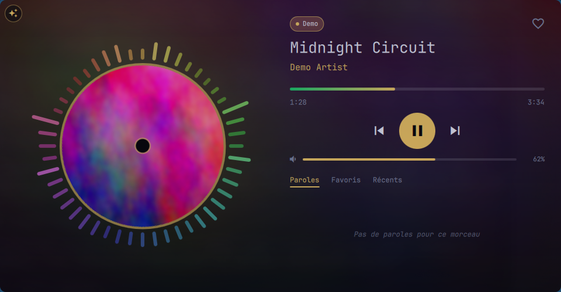
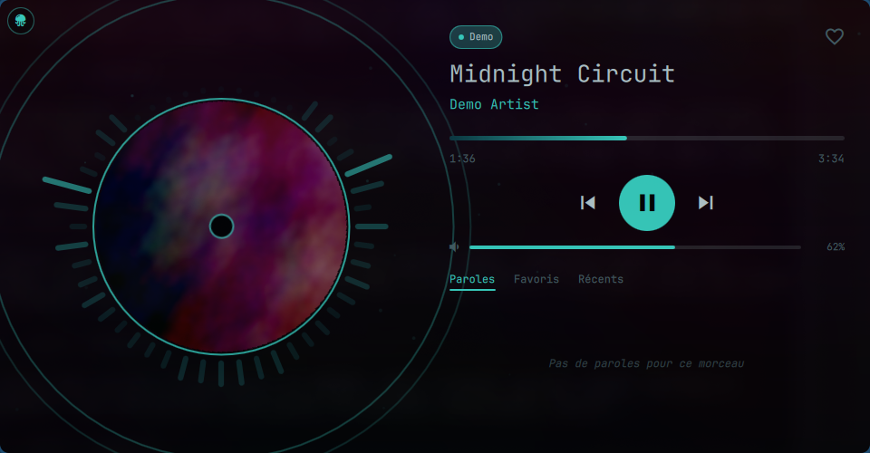
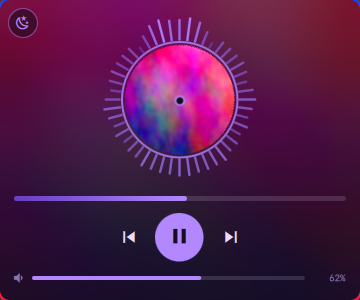
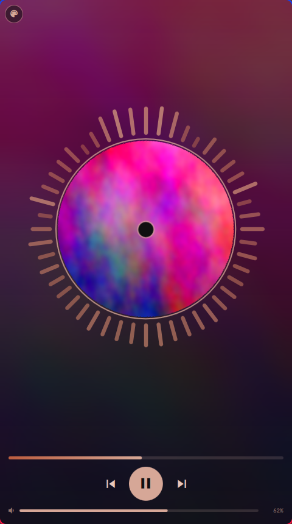

# Quickshell Music Player

A stylish, tileable music player window for **Hyprland**, built with [Quickshell](https://quickshell.org).
It doesn't play music itself: it controls whatever is already playing through **MPRIS**
(YouTube in your browser, Spotify, mpv…) and makes it look good.



| Abysse theme | Compact modes |
|---|---|
|  |   |

## Features

- **A real window that tiles**, not a popup. The layout adapts to the tile size:
  wide, tall, compact (visualizer + controls + volume only) and tiny (one line).
- **Spinning cover disc** with a circular **cava visualizer** around it, blurred cover as background.
- **Synced lyrics** from [lrclib.net](https://lrclib.net) (timing is stretched for *slowed* / *sped up* versions).
- **Several sources at once**: one chip per player, the selection stays put when you pause,
  and follows a source that starts playing.
- **Per-source volume bar** (the player's own volume, not the system mixer).
- **Favorites & history**, stored locally. Clicking an entry replays it in the background
  with `mpv` + `yt-dlp` (no browser tab needed).
- **Dock mode**: stick the player to a screen edge; a small handle stays visible and the card
  slides out when you hover it.
- **Themes** (button in the top-left corner): your wallpaper colors via [wallust](https://codeberg.org/explosion-mental/wallust),
  Red, Midnight blue, Dark, Violet, Green, and two animated ones:
  - **Aurore ✦**: hues drift through the rainbow, rainbow visualizer ring, light blobs that swell on the bass.
  - **Abysse**: almost black; beat detection sends sonar waves from the disc, glowing plankton and a
    darkened cover that flashes on every kick.
  - **Your own video themes**: a looping video as background (see below).
- **Battery friendly**: visualizer, animations and video pause when the player is not on screen
  (other workspace, dock card hidden).

## Requirements

- Hyprland, [Quickshell](https://quickshell.org) (tested with `quickshell-git` 0.3.x, Qt 6.11)
- `qt6-multimedia` + `qt6-multimedia-ffmpeg` (video themes only)
- `cava` (visualizer), `yt-dlp` + `mpv` + `mpv-mpris` (replaying favorites)
- Fonts: `JetBrains Mono` and a Nerd Font (`FantasqueSansM Nerd Font` by default, see `font` / `iconFont` in `shell.qml`)
- Optional: `wallust` (colors that follow your wallpaper)

On Arch:

```sh
yay -S quickshell-git qt6-multimedia qt6-multimedia-ffmpeg cava yt-dlp mpv mpv-mpris \
       ttf-jetbrains-mono ttf-fantasque-nerd
```

## Install

The folder name matters (`music-player`):

```sh
git clone https://github.com/clemuuuu/quickshell-music-player ~/.config/quickshell/music-player
```

Then add the keybinds from [`extras/hyprland-keybinds.conf`](extras/hyprland-keybinds.conf) to your Hyprland config:

| Shortcut | Action |
|---|---|
| `Super + Alt + M` | Open / close (or back to window mode when docked) |
| `Super + Shift + Alt + ←/→/↑/↓` | Dock to that edge (same key again = back to window) |

Inside the window: `Space` play/pause, `N` / `P` next/previous, `F` favorite, `←` / `→` seek ±5 s,
click the disc to pause, scroll on it for volume.

### Wallpaper colors (optional)

Copy [`extras/wallust/colors-music.json`](extras/wallust/colors-music.json) to `~/.config/wallust/templates/`
and add to `~/.config/wallust/wallust.toml`:

```toml
music.template = 'colors-music.json'
music.target = '~/.config/quickshell/music-player/colors.json'
```

Without it, the "wallpaper" theme uses built-in default colors.

## Browser with several tabs

Chromium-based browsers expose **only one** MPRIS player: the last tab that played. To see and control
each tab separately, install the [mpris-tabs](https://github.com/blez/mpris-tabs) extension
(third-party, not part of this project; read its code and permissions first). The player then hides the
browser's own entry and shows one chip per tab.

## Custom video themes

Put a video (and optionally a still image for the dock card) in `~/.local/share/music-player/themes/`
and describe it in `~/.local/share/music-player/themes/themes.json`:

```json
[
    {
        "id": "mytheme",
        "name": "My theme",
        "video": "background.mp4",
        "poster": "background.jpg",
        "bg": "#0b1020", "fg": "#eef2ff", "accent": "#7aa2ff", "accent2": "#2b3f8f", "muted": "#9aa6c4"
    }
]
```

The theme shows up in the theme cycle. Tips:

- 30 fps H.264 is plenty; with hardware decoding (VA-API: `intel-media-driver` on Intel,
  `mesa` on AMD) even 1080p costs almost nothing.
- A seamless loop: crossfade the end into the start, e.g. for a clip of `T` seconds and a 1.5 s fade:
  ```sh
  ffmpeg -i in.mp4 -filter_complex "[0:v]fps=30,split[a][b];[a]trim=start=1.5:end=T,setpts=PTS-STARTPTS[m];[b]trim=0:1.5,setpts=PTS-STARTPTS[h];[m][h]xfade=duration=1.5:offset=T-3[out]" -map "[out]" -an -c:v libx264 -crf 25 background.mp4
  ```
  (replace `T` and `T-3` with numbers).

## Files

| Path | What |
|---|---|
| `shell.qml` | The whole player (comments are in French) |
| `play.sh` | Replays a favorite with `mpv` (audio only, one at a time, remembered volume) |
| `cava.conf` | Visualizer settings |
| `extras/music-player.sh` | Open / close / dock script used by the keybinds |
| `~/.local/share/music-player/` | Your data: favorites & history, theme choice, video themes (never in this repo) |

IPC, if you want to script it: `qs -c music-player ipc call player <dock EDGE | undock | favorite | nextSource | getMode>`.

## Credits

- [Quickshell](https://quickshell.org), [cava](https://github.com/karlstav/cava), [lrclib.net](https://lrclib.net) for lyrics
- [mpris-tabs](https://github.com/blez/mpris-tabs) for per-tab browser control (optional)

## License

[MIT](LICENSE)
